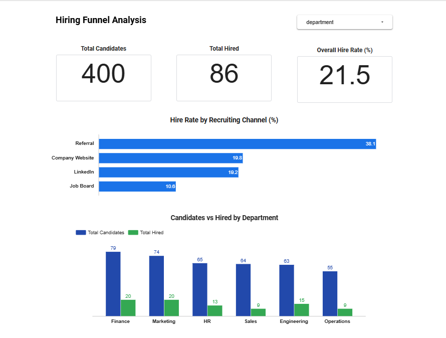
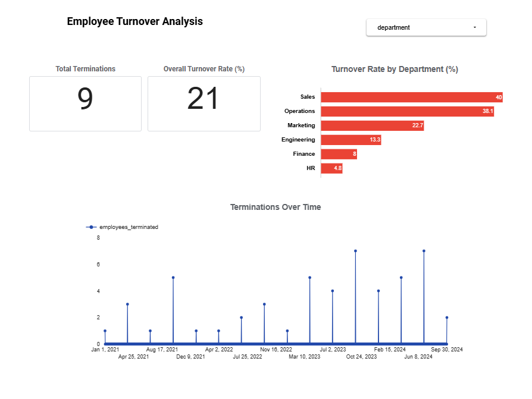
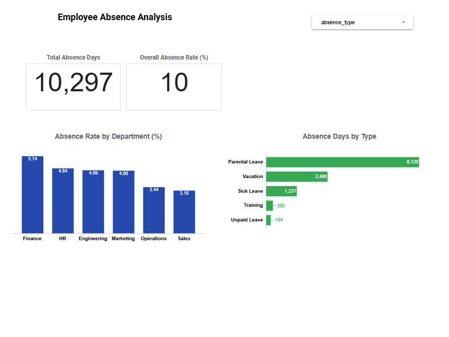

# HR People Analytics
### Recruiting, Workforce Turnover & Absence Analysis

## Project Overview

This project addresses a common challenge in HR management: understanding where hiring is most difficult, which departments lose the most employees, and how absence impacts workforce availability.

Built as a portfolio project demonstrating end-to-end analytics engineering skills — from raw data ingestion to a business-ready dashboard — using Google BigQuery and Looker Studio.

---

## Business Questions

1. **Hiring Funnel** — What is the conversion rate by recruiting channel and department? Which channels bring the best candidates?

2. **Employee Turnover** — Which departments have the highest termination rate? Is turnover increasing over time?

3. **Absence Analysis** — What is the absence rate by department and absence type? What is driving total absence days?

---

## Architecture

This project follows a three-layer data architecture in BigQuery:

```
Raw CSV Files
     ↓
Stage Layer — raw data loaded and quality-verified
     ↓
Integration Layer — business logic and calculated fields applied
     ↓
Consumer Layer — aggregated, dashboard-ready tables
     ↓
Looker Studio Dashboard — three-page interactive report
```

---

## Dataset

Synthetic data simulating a mid-sized European company with:
- **200 employees** across 6 departments
- **400 job candidates** from 4 recruiting channels
- **600 absence records** covering 2023–2024
- Departments: Engineering, Sales, Marketing, HR, Finance, Operations
- Recruiting channels: LinkedIn, Referral, Company Website, Job Board

---

## Key Findings

**Hiring Funnel**
- Referral is the strongest channel at 38.1% conversion rate
- Job Board is the weakest at 10.6%
- Finance and Marketing are the easiest departments to hire for

**Employee Turnover**
- Sales has the highest termination rate at 40%
- Operations follows at 38.1%
- HR and Finance are the most stable departments at under 10%
- Terminations show an upward trend from 2021 to 2024

**Absence Analysis**
- Overall absence rate is 10% of available working days
- Parental Leave accounts for the majority of total absence days (6,120)
- Finance has the highest absence rate at 5.74%
- Sick Leave is relatively low — a positive workforce health indicator

---

## Technical Highlights

- Built a fan-out bug fix using CTEs in the absence rate consumer table
- Rebuilt the turnover consumer table from scratch after identifying incorrect headcount calculations in the original query
- Created a quarter_start_date DATE field to enable correct chronological ordering in Looker Studio time series charts
- Used calculated fields in Looker Studio to fix incorrect rate aggregations
- Applied consistent SQL header comments across all queries for documentation and maintainability

---

## Tools & Technologies

| Tool | Purpose |
|---|---|
| Google BigQuery | Data warehouse and SQL engine |
| Looker Studio | Dashboard and visualization |
| Google Cloud Platform | Cloud infrastructure |
| GitHub | Version control and portfolio |

---

## Repository Structure

```
hr-people-analytics/
    /sql
        /stage          — data quality checks
        /integration    — business logic queries
        /consumer       — aggregation queries
    /data               — source CSV files
    /screenshots        — dashboard screenshots
    README.md
```

---

## Dashboard

Built in Looker Studio with three interactive pages:
- **Page 1** — Hiring Funnel Analysis
- **Page 2** — Employee Turnover Analysis
- **Page 3** — Employee Absence Analysis

[View Dashboard](https://datastudio.google.com/s/vMo-Qu0YbIA)

---

## Dashboard Screenshots

**Page 1 — Hiring Funnel Analysis**


**Page 2 — Employee Turnover Analysis**


**Page 3 — Employee Absence Analysis**


---

## Author

**Ubiratan Gonzaga**
Data Analysis & Analytics Engineering Student
Graduating September 2026
